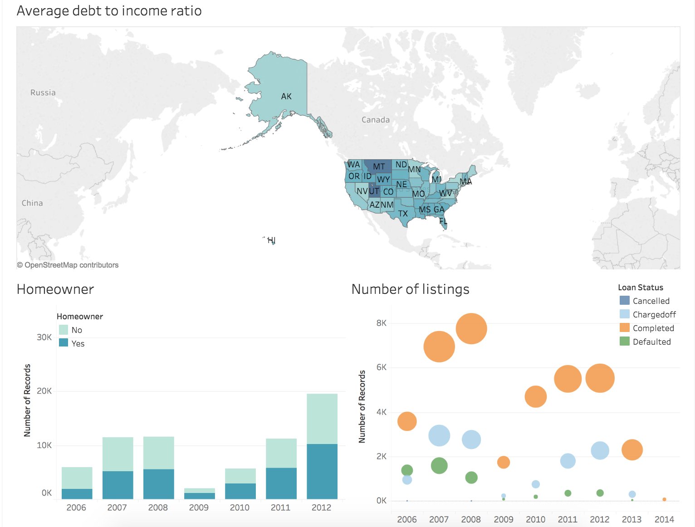

# Tableau-Project
This repository contains the analysis and visualisations I have created in Tableau.

## Prosper Loan Data Visualisation
The final version of this visualisation can be found [here](https://public.tableau.com/profile/sian.nadin#!/vizhome/Prosperloandata-Version2/ProsperLoandata-Version2)

### About
Prosper is a peer-to-peer lending platform that aims to connect people who need money with those people who have the money to invest. In this data analysis project,
In my Tableau story I have done exploration on the relationship between loans and the people acquiring them, the reasons for taking out a loan and who defaults the most. I have given a brief insight into the people acquiring loans by looking at the debt levels by state as well as the amount of money borrowed over the past few years looking at whether or not people were homeowners. I explored the reasons that people have for taking out loans as well as who is most likely to default based on their occupation and income range. Breaking down the number of defaulters by occupation it seems that college student have the highest borrower and default rates.

### Dataset
The Prosper loan data set contains 113,937 loans with 81 variables on each loan,
including loan amount, borrower rate (or interest rate), current loan status,
borrower income, and many others. The dataset and data-dictionary can be found at the link below:
[Udacity hosted dataset dataset](https://s3.amazonaws.com/udacity-hosted-downloads/ud651/prosperLoanData.csv)

### Summary
In peer-to-peer lending, there are three main stakeholders: borrowers, lenders and the company itself. In my Tableau story I have done exploration on the relationship between these people, what affects borrowers Prosper Score and who defaults the most.

